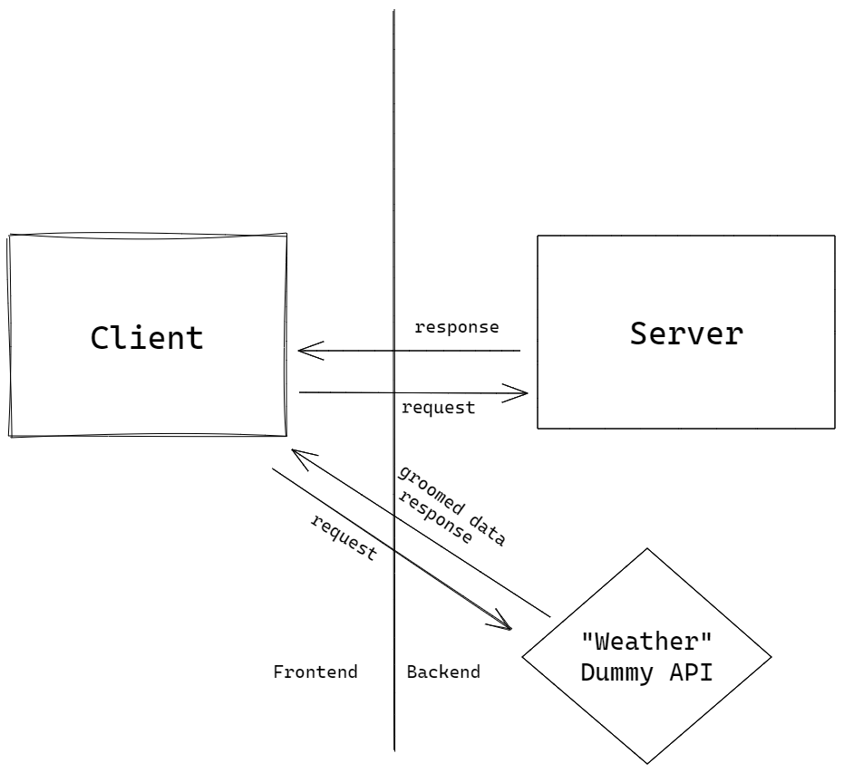
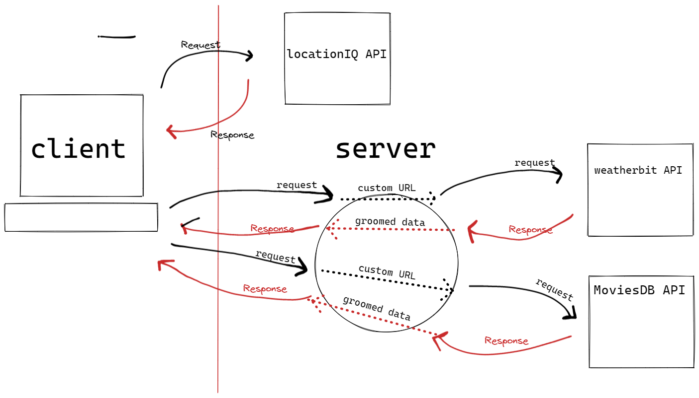
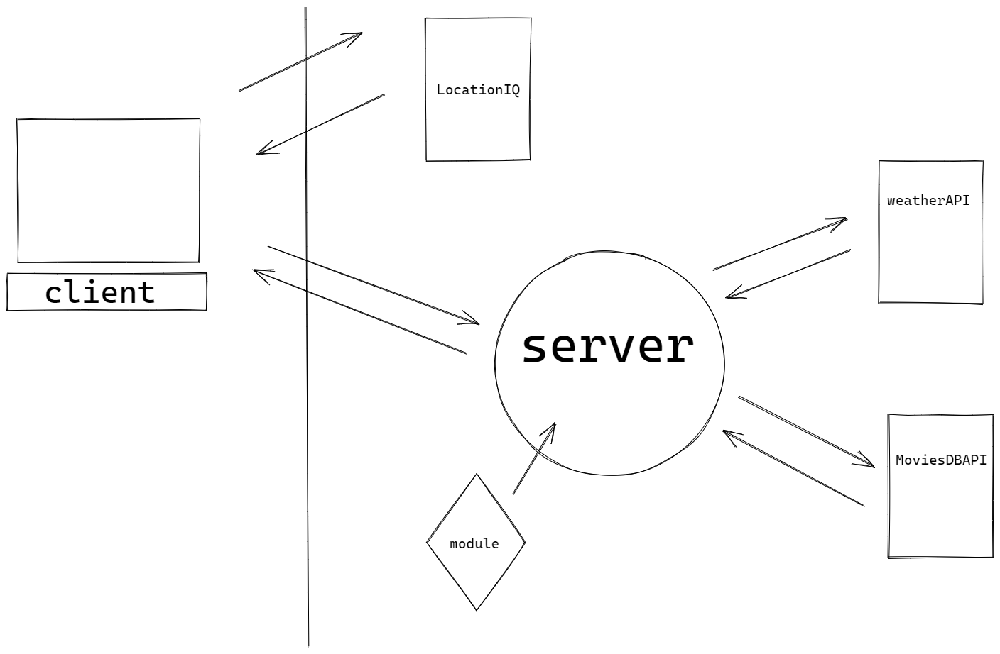

# city-explorer-api

**Author**: Kevin LaMarca
**Version**: 1.0.3

## Overview
In city-explorer-api, I create a server using node.js that handles requests and serves data to front end app built by me. 

## Getting Started
<!-- What are the steps that a user must take in order to build this app on their own machine and get it running? -->

## Architecture
1/18: 

1/19 

1.20 
## Change Log
<!-- Use this area to document the iterative changes made to your application as each feature is successfully implemented. Use time stamps. Here's an example:

01-01-2001 4:59pm - Application now has a fully-functional express server, with a GET route for the location resource. -->

## Credit and Collaborations
<!-- Give credit (and a link) to other people or resources that helped you build this application. -->
Name of feature: path for weather

Estimate of time needed to complete: 10 mins

Start time: 10:00pm

Finish time: 10:10pm

Actual time needed to complete: 10 mins

Name of feature: data processing functionality

Estimate of time needed to complete: 20 mins

Start time: 10:10pm

Finish time: 10:30

Actual time needed to complete: 20 mins

Name of feature: constructor func for groomed data

Estimate of time needed to complete: 30 mins

Start time: 11:00pm

Finish time: 11:30pm

Actual time needed to complete: 30 mins

Name of feature: Added request and response for Movie data via API and created constructor func for data processing

Estimate of time needed to complete: 30 mins

Start time: 6:50pm

Finish time: 7:200pm

Actual time needed to complete: 30 mins

Name of feature: Implemented cache functionality and conditional API calls

Estimate of time needed to complete: 30 mins

Start time: 5:30pm

Finish time: 5:50pm

Actual time needed to complete: 20 mins

